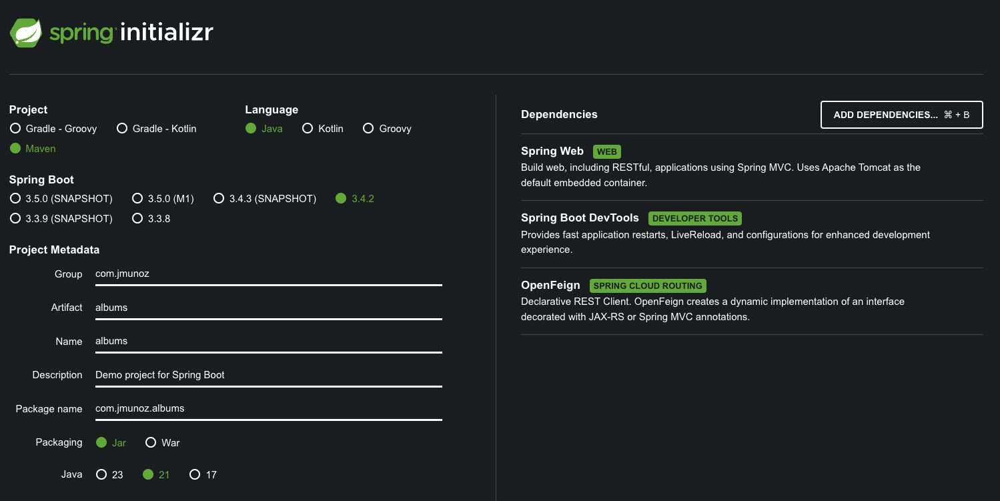

# SPRING BOOT 3 COOKBOOK

Aplicación cliente hecha en Spring Boot que consume un API RESTful.

Se usa `Spring Boot` y `FeignClient`.

## Creación de proyecto

Uso Spring Initializr: `https://start.spring.io/`

## Ejecución del proyecto

- Clonar/descargar este proyecto
- Clonar/descargar y ejecutar el proyecto backend `Spring-Boot-footbal-cards`
  - https://github.com/JoseManuelMunozManzano/Spring-Boot-football-cards
  - Ver su archivo `README.md`
- Ejecutar este proyecto con el comando: `./mvnw spring-boot:run -Dspring-boot.run.arguments=--server.port=8081` para evitar conflictos de puertos
    - O ejecutar directamente desde IntelliJ Idea
- En la carpeta `postman` se encuentran los endpoints para probar

## Uso de Spring Boot y FeignClient para consumir un API RESTful

Consumimos los endpoints del proyecto backend football: `https://github.com/JoseManuelMunozManzano/Spring-Boot-football-cards`.

Creamos el paquete `model` y dentro el record `Player.java`.

Creamos el paquete `webclient` y dentro la interface `FootballClient.java`.

Creamos el paquete `controller` y dentro el controlador `AlbumsController.java`.

Modificamos el archivo `AlbumsApplication.java` para añadir la anotación `@EnableFeignClients`.

Feign es un framework de cliente de servicio web declarativo que simplifica la realización de peticiones HTTP a servicios web RESTful.

Hay otras opciones que nos sirven para hacer peticiones HTTP a aplicaciones del lado de servidor, pero Feign tiene una gran integración con componentes Spring Cloud, como Eureka Server.

Más adelante veremos como se integra con Spring Cloud y como puede hacer balanceo de carga en el lado del cliente.

Este código del lado del cliente podría haberse generado automáticamente usando herramientas, que son muy útiles para mantenerlo sincronizado con las descripciones del lado del servidor.

Estas herramientas usan las descripciones OpenAPI expuestas por el API RESTful para generar el código de cliente:

- OpenAPITools: https://github.com/OpenAPITools/openapi-generator
- swagger-codegen: https://github.com/swagger-api/swagger-codegen

Ambos proyectos proveen una herramienta de línea de comandos y un plugin Maven para generar código del lado del cliente.